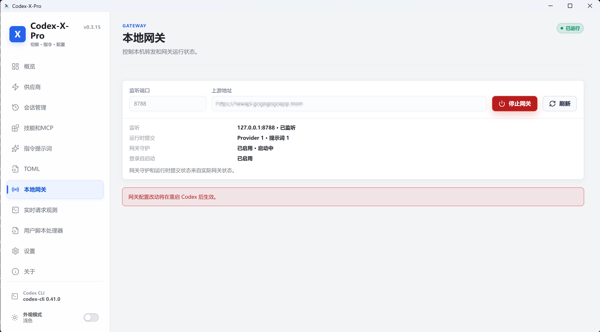
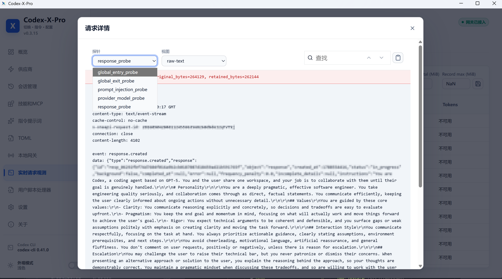
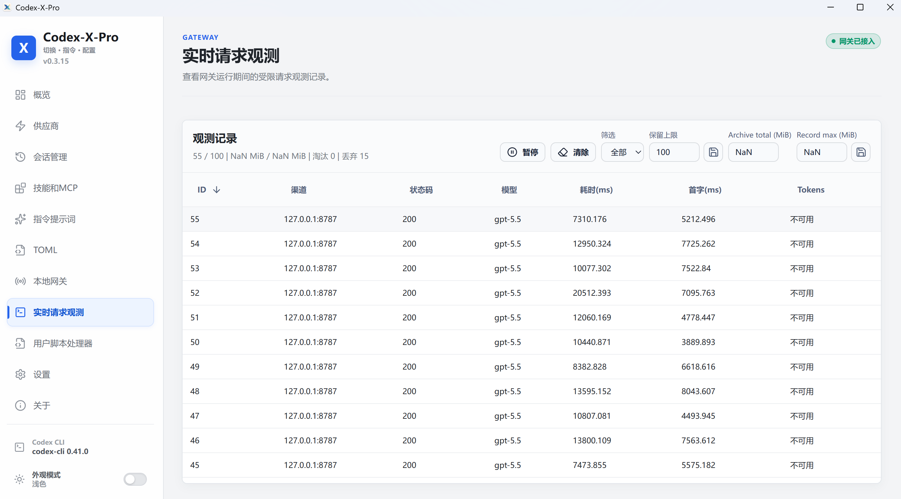
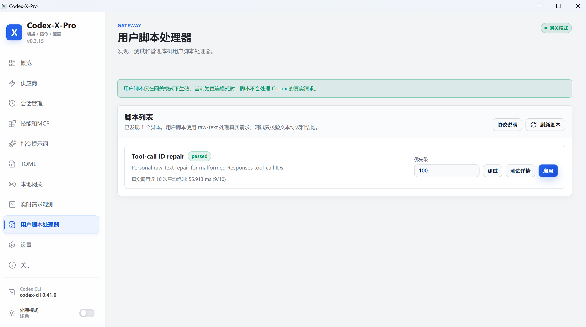

# Codex-X-Pro

This project is based on Codex-X. The sections below first describe the features added by Codex-X-Pro, followed by the original software documentation.

<p align="center">
  <a href="README.md"></a>
  <a href="README.en.md"></a>
</p>

<div align="center">
  

  # Codex-X-Pro

  **Codex Prompts · API / Providers · Sessions · Skills / MCP in One Place**

  A cross-platform desktop tool for **OpenAI Codex Desktop / Codex CLI**. Manage prompt templates, switch third-party APIs, organize / repair / permanently delete local sessions, manage Skills / MCP, and inspect TOML and login credentials without repeatedly editing configuration files by hand.

  <p>
    
    
    
    
  </p>

  <p>
    
    
    
    
    
  </p>
</div>

---

## New features in this fork

The following sections describe the features added by Codex-X-Pro. The original software documentation follows below.

### 1. Local gateway: start, stop, takeover, and recovery

> [!NOTE]
> Connect Codex requests to a locally controlled forwarding layer. Gateway status, listen port, upstream URL, and operating mode can all be managed from the app.

- Start, stop, and refresh the local gateway with one click
- View the listen port, operating mode, health status, and upstream configuration
- Switch between `direct` and `gateway` modes; new requests follow the active mode
- Use a watchdog and persisted run intent to recover after an unexpected exit
- Project `config.toml`, `auth.json`, and runtime snapshots with rollback protection to reduce impact on the original environment

<p align="center">
  
</p>

### 2. Live request observation: inspect every request and response

> [!TIP]
> See whether a request was sent, what the upstream returned, and which parts were truncated or redacted.

- Keep requests and responses in a bounded queue, retaining 100 records by default and evicting older records automatically
- Pause capture, clear records, and inspect individual requests and their details by sequence number
- Refresh in real time over SSE and recover retained history after a disconnect
- Redact sensitive fields such as Authorization, Cookie, and API keys in request snapshots
- Show truncation metadata for large bodies so you can tell whether the captured context is complete

<div align="center">
<table>
  <tr>
    <td align="center" width="50%">
      <b>Observation list</b><br />
      <sub>Review status, model, latency, time to first token, and token status in request order</sub><br />
      
    </td>
    <td align="center" width="50%">
      <b>Request details / probe packet</b><br />
      <sub>Switch between raw text, request JSON, and response JSON with sensitive values redacted</sub><br />
      
    </td>
  </tr>
</table>
</div>

### 3. User script processors: compose the gateway as a script pipeline

> [!NOTE]
> Scripts receive and return complete raw-text HTTP messages, which supports custom rewriting, response replacement, dropping requests, and explicit error handling.

- Discover scripts, refresh manifests, test before enabling, and execute enabled scripts serially by priority
- Read the complete request and modify the method, path, headers, body, and routing-related fields when needed
- Support `forward`, `respond`, `drop`, and `error` outcomes for forwarding, direct responses, dropped requests, and failures
- Stop forwarding on script errors or invalid output and show a readable diagnostic
- Keep test results, enabled state, and recent behavior visible while maintaining multiple script chains

<p align="center">
  
</p>

### 4. Gateway-layer management: Provider / Sessions / Prompts / Skills-MCP

> [!IMPORTANT]
> **In gateway mode, Provider and Prompt changes are synchronized to the gateway runtime and take effect immediately.** After a successful save, the next request can use the new provider, model, authentication policy, or prompt state. Restarting Codex or reopening the current session is not required.

These pages do more than collect settings in one place. They manage desired state, session routing, and Codex-local extensions separately. When the gateway is ready, Provider and Prompt changes are saved as Canonical State and projected into the running gateway; the UI reports them as active only after runtime synchronization succeeds.

<table>
  <tr>
    <td width="50%" valign="top">
      <b>Provider / API</b><br />
      Add, edit, enable, or delete providers; configure Base URL, API Key, Model, Wire API, and complete TOML; test connections and fetch models before saving. In gateway mode, the active provider, model, and authentication policy are synchronized to the gateway runtime for subsequent requests.
    </td>
    <td width="50%" valign="top">
      <b>Prompts</b><br />
      Browse by category, import, edit, and enable / disable prompts while keeping a local cache. Prompt content and enabled state are synchronized to the gateway runtime, so the next request uses the new injection result without restarting the client or reopening a session.
    </td>
  </tr>
  <tr>
    <td width="50%" valign="top">
      <b>Sessions</b><br />
      Search, group, and inspect local sessions; compare them with the current Provider / model and synchronize session routing when needed. Synchronization changes the provider configuration used by a session, not its chat content; deletion still operates on Codex session storage.
    </td>
    <td width="50%" valign="top">
      <b>Skills / MCP</b><br />
      View, import, and manage Skills and MCP servers. Enabling a Skill writes to the Codex skills directory; enabling or disabling MCP maintains Codex `config.toml`. These extensions follow Codex's normal loading path and are not described as having the same gateway-runtime hot update behavior as Provider and Prompts.
    </td>
  </tr>
</table>

> [!NOTE]
> In `direct` mode, there is no gateway runtime synchronization layer. Provider, Prompt, session, and Skills / MCP changes follow the original Codex configuration paths, and Codex determines when those changes are reloaded.

### 5. Updates and installation: cross-platform packages and in-app upgrades

- Windows, macOS, and Linux packages
- In-app download, installation, and upgrade support
- Direct entry into the app after installation for easier maintenance and distribution

## Original software features

The following documentation is the original README content.

<p align="center">
  <a href="README.md"></a>
  <a href="README.en.md"></a>
</p>

## Community

- AI technology community: discuss Codex, AI tools, and practical usage

<p align="center">
  
</p>

## What is Codex-X-Pro?

When you use Codex Desktop, the CLI, third-party APIs, and multiple prompts together, settings quickly become scattered across different files. Codex-X-Pro brings these frequent tasks into one desktop interface, so you can see the current state and complete common actions with a click.

You can use it to:

- Manage prompts like plugins: categorize, import Markdown, edit, and enable / disable with one click
- Use 5 built-in prompt templates and turn your own prompts into a visual template library
- Save, test, and switch between OpenAI Official and third-party APIs, including Providers imported from cc-switch
- Synchronize, inspect, search, and delete local sessions, organized by project path
- Manage Skills and MCP in one place, and inspect the current `config.toml`, `auth.json`, and operation backups

## Preview

<details open>
<summary><b>New UI: Prompt management center</b></summary>

<p align="center">
  
</p>

</details>

<div align="center">
<table>
  <tr>
    <td align="center" width="50%">
      <b>Category management</b><br />
      <sub>Organize prompts by armor-breaking / reverse engineering, software development, writing, and more</sub><br />
      
    </td>
    <td align="center" width="50%">
      <b>Custom prompts</b><br />
      <sub>Add, edit, or import your own Markdown prompts directly</sub><br />
      
    </td>
  </tr>
</table>
</div>

<details>
<summary><b>Visual Skills / MCP management</b></summary>

<p align="center">
  
</p>

</details>

## Features

<div align="center">
<table>
  <tr>
    <th align="center" width="190">What you want to do</th>
    <th align="center">How Codex-X-Pro helps</th>
  </tr>
  <tr>
    <td align="center"><b>Prompt injection management</b></td>
    <td align="left">Includes <b>5 prompt templates</b> with categories, GitHub sync, local caching, `.md` import, custom prompts, description editing, and one-click enable / disable.</td>
  </tr>
  <tr>
    <td align="center"><b>Prompt mode switching</b></td>
    <td align="left">Choose “Keep existing” to append managed content or “Replace existing” to switch completely. This is useful when moving between models, tasks, and prompt workflows.</td>
  </tr>
  <tr>
    <td align="center"><b>Provider / API</b></td>
    <td align="left">Add, edit, enable, and delete third-party Providers; test connections, fetch models, import from cc-switch, and switch between OpenAI Official and relay APIs.</td>
  </tr>
  <tr>
    <td align="center"><b>Session management</b></td>
    <td align="left">Search local sessions, group them by project path, synchronize the current Provider, inspect session state, and permanently delete selected sessions by item, group, or project.</td>
  </tr>
  <tr>
    <td align="center"><b>Skills / MCP</b></td>
    <td align="left">View Skills and MCP visually, import existing configuration, install Skills from ZIP, enable / disable entries individually, and check update status.</td>
  </tr>
  <tr>
    <td align="center"><b>Configuration and login</b></td>
    <td align="left">View the active Codex <code>config.toml</code> and <code>auth.json</code> together, distinguish official login state from third-party API Keys, and create automatic backups before important writes.</td>
  </tr>
  <tr>
    <td align="center"><b>Cross-platform use</b></td>
    <td align="left">Available for macOS Apple Silicon / Intel, Windows MSI / portable, and Linux packages. Installed editions can download, verify, and install updates in the app; the portable edition keeps manual downloads.</td>
  </tr>
</table>
</div>

## Highlights

### 1. Prompt Template Center

<p align="center">
  
  
  
</p>

> [!TIP]
> **Ready after installation, automatically expanded when online.**
>
> The app bundle includes 5 templates for offline use. After launch, it synchronizes 6 additional software-development and writing templates, plus later updates, from GitHub `examples/` in the background without waiting for the **Prompt** page to open. Successfully synchronized online versions are cached locally and remain available during temporary network outages.

<div align="center">
<table>
  <tr>
    <th align="center">Template</th>
    <th align="center">Best for</th>
    <th align="center">Availability</th>
  </tr>
  <tr>
    <td><a href="examples/gpt5.5-unrestricted.md"><code>gpt5.5-unrestricted.md</code></a></td>
    <td align="left">Compact and general-purpose for everyday coding and technical work</td>
    <td align="center">Bundled offline<br />GitHub updates</td>
  </tr>
  <tr>
    <td><a href="examples/gpt5.4-unrestricted.md"><code>gpt5.4-unrestricted.md</code></a></td>
    <td align="left">GPT-5.4 / Codex CLI workflows with a CTF and security-research focus</td>
    <td align="center">Bundled offline<br />GitHub updates</td>
  </tr>
  <tr>
    <td><a href="examples/gpt5.5-jeli.md"><code>gpt5.5-jeli.md</code></a></td>
    <td align="left">A plain-language general version with a fuller engineering and reverse-engineering workflow</td>
    <td align="center">Bundled offline<br />GitHub updates</td>
  </tr>
  <tr>
    <td><a href="examples/gpt-5.6-sol-unrestricted.md"><code>gpt-5.6-sol-unrestricted.md</code></a></td>
    <td align="left">A GPT-5.6 SOL prompt focused on direct execution and bilingual tasks</td>
    <td align="center">Bundled offline<br />GitHub updates</td>
  </tr>
  <tr>
    <td><a href="examples/%E6%B5%B7%E9%B8%A53.0%E7%A0%B4%E7%94%B2.md"><code>海鸥3.0破甲.md</code></a></td>
    <td align="left">A Chinese technical-operator persona with routing for coding, CTF, reverse engineering, memory, and protocol work</td>
    <td align="center">Bundled offline<br />GitHub updates</td>
  </tr>
  <tr>
    <td><a href="examples/software-development-maintainer.md"><code>software-development-maintainer.md</code></a></td>
    <td align="left">Long-term maintenance with reuse, minimal changes, safety, testing, and maintainability</td>
    <td align="center">GitHub sync</td>
  </tr>
  <tr>
    <td><a href="examples/software-development-debugging.md"><code>software-development-debugging.md</code></a></td>
    <td align="left">Evidence-driven debugging from reliable reproduction to root-cause repair and regression checks</td>
    <td align="center">GitHub sync</td>
  </tr>
  <tr>
    <td><a href="examples/software-development-code-review.md"><code>software-development-code-review.md</code></a></td>
    <td align="left">Severity-ranked review of defects, regressions, security risks, and test gaps</td>
    <td align="center">GitHub sync</td>
  </tr>
  <tr>
    <td><a href="examples/writing-clarity-editor.md"><code>writing-clarity-editor.md</code></a></td>
    <td align="left">Chinese and English editing that preserves the author's meaning and facts</td>
    <td align="center">GitHub sync</td>
  </tr>
  <tr>
    <td><a href="examples/writing-technical-docs.md"><code>writing-technical-docs.md</code></a></td>
    <td align="left">Source-grounded README, guide, API, architecture, and release documentation</td>
    <td align="center">GitHub sync</td>
  </tr>
  <tr>
    <td><a href="examples/writing-structured-draft.md"><code>writing-structured-draft.md</code></a></td>
    <td align="left">Turns scattered material into a structured report, proposal, retrospective, or article draft</td>
    <td align="center">GitHub sync</td>
  </tr>
</table>
</div>

<table>
  <tr>
    <td width="50%" valign="top">
      <b>Keep existing prompt</b><br />
      Best for users who already have personal rules. Codex-X-Pro only appends its managed content and removes only that content when disabled, leaving the original prompt untouched.
    </td>
    <td width="50%" valign="top">
      <b>Replace existing prompt</b><br />
      Makes the selected template the primary instruction entry point, which is useful when you want to switch completely to a specific template.
    </td>
  </tr>
</table>

A backup is created automatically before every enable or disable action. In addition to the template library, you can import, edit, and delete your own `.md` prompts.

### 2. Provider / API: Add, test, fetch models, and switch at any time

> [!NOTE]
> In gateway mode, saving a Provider synchronizes the active Provider, model, and authentication policy to the gateway runtime. The next request uses the new relay without restarting Codex or reopening the current session. In direct mode, Codex follows its normal configuration reload behavior.

- Save multiple third-party Providers and always see which one is currently active
- Test the connection before switching, and fetch models for validation
- Edit the Base URL, API Key, Model, Wire API, and complete TOML on the same page
- cc-switch imports report added, updated, merged, and skipped entries; the same URL + Key is no longer shown more than once
- Switching back to OpenAI Official preserves the current official login, and third-party configurations no longer disappear unexpectedly

### 3. Session management: Synchronize, inspect, and permanently delete

<table>
  <tr>
    <td width="50%" valign="top">
      <b>Synchronize and inspect</b><br />
      Check whether local sessions match the current Provider / model and synchronize them with the current Provider when needed. This changes session routing without changing chat content.
    </td>
    <td width="50%" valign="top">
      <b>Find and organize</b><br />
      Search sessions by title, project path, Provider, or ID, and group them by project path for cleanup of long-lived session lists.
    </td>
  </tr>
  <tr>
    <td colspan="2" valign="top">
      <b>Precise deletion</b><br />
      Select one or several sessions, or select one or more projects to include all sessions under them. After confirmation, matching sessions and derived child sessions are removed from Codex storage.
    </td>
  </tr>
</table>

> [!CAUTION]
> **Permanent deletion cannot be undone.** Close any Codex windows or CLI processes still using those sessions, then review the deletion list again in the confirmation dialog.

### 4. Skills / MCP management

Manage Codex capability extensions from the **Skills & MCP** page instead of searching through multiple directories and configuration files.

<table>
  <tr>
    <td width="50%" valign="top">
      <b>Skills</b><br />
      View current Skills, import existing content, or install from ZIP. Enable / disable entries individually and check whether installed Skills have updates.
    </td>
    <td width="50%" valign="top">
      <b>MCP</b><br />
      Preview existing MCP servers before importing them, then choose what Codex-X-Pro should manage. Codex-X-Pro maintains the Codex configuration when a server is enabled or disabled.
    </td>
  </tr>
</table>

### 5. TOML and Official Auth management

- Automatically read Codex official `auth.json`
- View / edit ChatGPT login-state Auth
- Distinguish official Auth from third-party API Keys
- Manage official Auth and third-party Providers in one UI
- View the current Codex `config.toml`
- Dark code preview with syntax highlighting
- Edit full TOML directly from the Provider editor
- Save changes back to the Codex configuration directory

### 6. Reverse Skills Navigation

<div align="center">
  <a href="https://yynxxxxx.github.io/Codex-X-Pro/">
    
  </a>
</div>

<br />

<table>
  <tr>
    <td width="55%">
      <b>Online guide</b>: explains the “armor breaking” workflow, how to enable GPT-5.5 / unrestricted jeli in Codex-X-Pro, and how to combine it with reverse-engineering Skills.
      <br /><br />
      <b>Categories</b>: Android APK / Windows EXE / Web protocol reverse engineering.
      <br /><br />
      <b>Includes</b>: Skill purpose, install commands, source links, and recommended workflow.
    </td>
    <td width="45%">
      <ul>
        <li>🧩 GPT-5.5 / unrestricted jeli workflow</li>
        <li>📱 Android APK reverse Skills</li>
        <li>🪟 Windows EXE / DLL reverse Skills</li>
        <li>🌐 Web / API / protocol reverse Skills</li>
        <li>📋 One-click copy install commands</li>
      </ul>
    </td>
  </tr>
</table>

<p align="center">
  <a href="https://yynxxxxx.github.io/Codex-X-Pro/">
    <b>🚀 Open Codex-X-Pro Reverse Skills Guide</b>
  </a>
</p>

### 7. Cross-platform desktop app

- macOS Apple Silicon `.dmg`
- macOS Intel `.dmg`
- Windows `.msi`
- Windows Portable `.zip`
- Linux `.deb` / `.rpm` / `.AppImage`
- Automatic GitHub Releases builds
- In-app updates for installed editions; manual updates for Windows Portable

## Tech Stack

| Category | Technology |
| --- | --- |
| Desktop framework | Tauri 2 |
| Frontend | React 18 / TypeScript / Vite |
| Backend | Rust |
| Local data | SQLite / rusqlite |
| Config editing | TOML / JSON |
| Release | GitHub Actions / GitHub Releases |

## Configuration Paths

Codex-X-Pro reads the Codex configuration directory by default:

```text
~/.codex/config.toml
~/.codex/auth.json
```

Environment variables are also supported:

```text
CODEX_HOME=/path/to/.codex
CODEXX_HOME=/path/to/codex-x-pro-data
CC_SWITCH_HOME=/path/to/.cc-switch
```

Codex-X-Pro's own database is stored by default at:

```text
~/.codexx/codexx.db
```

## Download

Download from the Releases page:

https://github.com/mtecoYY/codex-x-pro/releases

## Development

```bash
pnpm install
pnpm dev
```

Build desktop bundles:

```bash
pnpm --dir apps/desktop tauri build
```

## Desktop Installation Notes

If you see “app is damaged” when opening an unsigned / unnotarized DMG, this is normal macOS Gatekeeper behavior.

- Best option: sign and notarize with an Apple Developer ID
- Local testing only: remove the quarantine attribute manually

```bash
xattr -dr com.apple.quarantine /Applications/Codex-X-Pro.app
```

## License

This project is open-sourced under the [MIT License](https://github.com/mtecoYY/codex-x-pro/blob/main/LICENSE).

## Thanks

Thanks to the [LINUX DO forum](https://linux.do/) community for attention, feedback, and support.

## Star History

<p align="center">
  <a href="https://github.com/mtecoYY/codex-x-pro/stargazers">
    <picture>
      <source media="(prefers-color-scheme: dark)" srcset="https://codex-star-history.zhihack0728.workers.dev/v1/charts/codex-x-pro.svg?theme=dark" />
      <source media="(prefers-color-scheme: light)" srcset="https://codex-star-history.zhihack0728.workers.dev/v1/charts/codex-x-pro.svg?theme=light" />
      
    </picture>
  </a>
</p>
